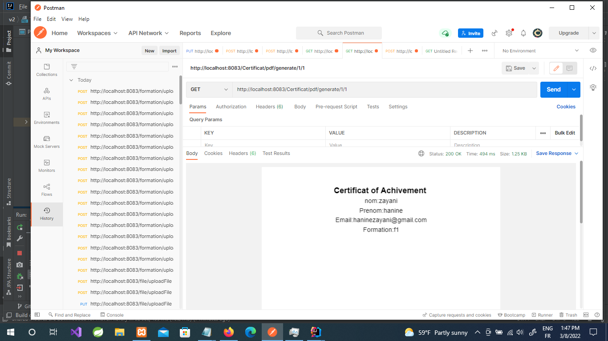

**Test Postman** 

**Formation**
**@PostMapping("/save")**
créer formation

formateur peut virer, sactionner ou Avertir l'apprenant 

**@PutMapping("/uploadFile/{id}")**
uploadFile & affectation à formation

**Evaluation**
l'apprenant evalue (rating)la formation
**@PutMapping("/save/{user_id}/{formation_id}/{rating}")**

**Certificat**
l'admin gére les certificat :
export file dont les corrdonner de l'apprenant afin qu'il puisse lui préparer son Certif
**@GetMapping("/pdf/generate/{id}/{idf}")**

créer certificat
**@PostMapping("/save")**

l'admin envoie un email notifiant l'apprenent que son certif est prête .
**@GetMapping("/sendmail/{id}")**

un Qr code sera géner ; l'apprenant peut consulter son certif en ligne en scannant le Qr Code 

@GetMapping("/pdf/generate/{id}/{idf}")
